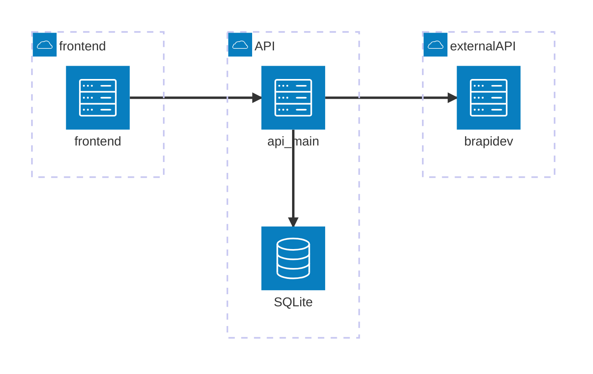

# Pós Eng. Soft. PUC-Rio
## MVP Arquitetura de Software - mvp-ativos-frontend

### Intro

Nesse mvp a ideia foi criar um sistema simples de uma carteira de ativos (ações nesse mvp).

Na carteira podem ser incluídos as ações com base no código de negociação. Devem ser informados o código, nome da empresa, quantidade e o preço médio.

**Exemplo:**

* **Código**: PETR4 (código do ativo na B3 - Bolsa de Valores);
* **Nome**: Petrobras PN;
* **Quantidade**: Número de papéis, ex: 500;
* **Preço Médio**: Média ponderada do precos de aquisição (o conceito de preço médio é utilizado para fins de apuração de imposto);

Além dessas informações os ativos ainda podem conter as seguinte informações:

* **Cotação**: cotação atualizada da última preço de fechamento disponível - api externa;
* **Data Cotação**: Data/Hora da cotação - api externa.

### Diagrama de arquitetura

O mvp foi estruturado conforme o diagrama:



* **api-main** - responsável pela regra de negócio, comunicação com a base de dados e requisições à api externa. [git backend](github.com/rafgartzia/mvp-ativos-api-main)

* **frontend** - camada de apresentação

* **api externa** - nesse projeto foi utilizado a api [brapi.dev](brapi.dev). Essa api fornece diversos dados relativos ao mercado de ações brasileiro. Para uso da api de forma gratuita é necessário cadastro prévio. A documentação está disponível em [docs](brapi.dev/docs).

Para esse mvp utilizamos o endpoint "quote", passando com informação o código do ativo e o período de 1 dia, para que seja retornada o último preço de fechamento disponível.

```
   https://brapi.dev/api/quote/simbolo?range=1d&token=token
```
```
   simbolo = código do ativo
```
```
   token = token pessoal configurado na plataforma brapi.dev
```

## Executando como container

Com o [Docker](https://docs.docker.com/engine/install/) instalado e em execução.

Navegue até o diretório que contém o Dockerfile no terminal.
Execute **como administrador** o seguinte comando para construir a imagem Docker:

```
$ docker build -t front .
```

Uma vez criada a imagem, para executar o container basta executar, **como administrador**, seguinte o comando:

```
$ docker run -p 80:80 front
```

Abra o [http://localhost:8080/#/](http://localhost:8080/#/) no navegador para acessar o frontend.
